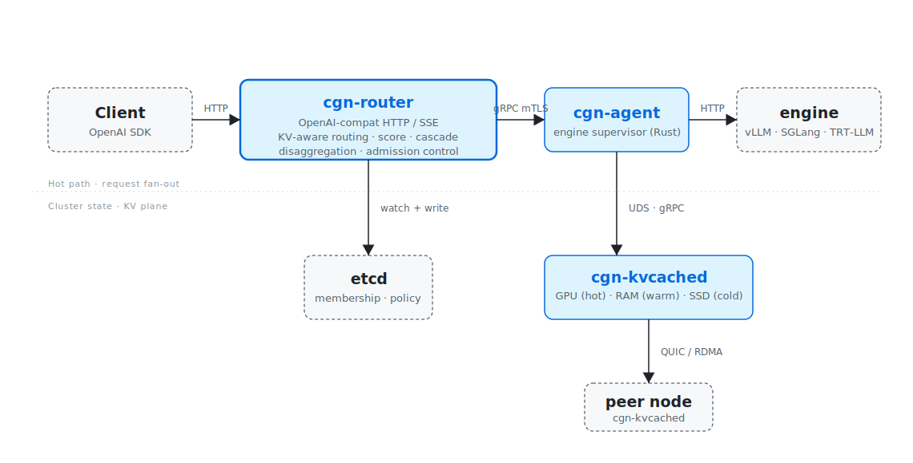

<div align="center">

# Cognitora

**Open, distributed LLM inference platform.**

KV-aware routing · Prefill/decode disaggregation · GPU/RAM/SSD KV tiering · Multi-model cascade (SLM → Mid → LLM) · Energy-aware scheduling · One-line installer for bare metal, Kubernetes, AWS, GCP, Azure, Hetzner.

[](LICENSE)
[](.github/workflows/ci.yml)
[](https://cognitora.dev)

</div>

---

## What is Cognitora?

Cognitora is a low-overhead orchestration layer that turns one or many LLM inference workers into a production-grade cluster — with **KV-aware routing**, **prefill/decode disaggregation**, **multi-tier KV caching** (GPU/RAM/SSD), and **energy-aware scheduling** as first-class concerns.

It is **engine-agnostic by design**: the agent process drives the inference engine over a stable internal contract — anything that speaks the OpenAI HTTP surface (`/v1/chat/completions`, `/v1/completions`, `/v1/models`, `/health`) plugs in. Three drivers ship today:

- **`vllm`** — agent spawns `vllm serve <model> ...` (NVIDIA GPU).
- **`llama_cpp`** — agent spawns `python -m llama_cpp.server ...` or a standalone `llama-server` binary (CPU or GPU offload).
- **`openai_compat`** — agent does not spawn anything; it proxies to a pre-managed engine at `engine.url` (Ollama, vLLM-as-a-service, hosted endpoints, ...).

Adding SGLang or TensorRT-LLM is a thin driver on the same trait — see [`docs/reference/config.md`](docs/reference/config.md). The engine itself is always left untouched and runs as a supervised child (or remote) process per node.

Every Cognitora binary is **a single statically-linked Rust executable** — no Python, Go, or JVM runtime in any container.

<p align="center">
  
</p>

## Why Cognitora?

| Capability                     | Cognitora            | Single engine | NVIDIA Dynamo | KServe |
| ------------------------------ | -------------------- | ------------- | ------------- | ------ |
| KV-aware prefix routing        | yes (BLAKE3 trie)    | local only    | yes           | basic  |
| Prefill/decode disaggregate    | yes (QUIC handoff)   | no            | yes           | no     |
| GPU/RAM/SSD KV tiering         | yes (RocksDB index)  | host only     | partial       | no     |
| Multi-model cascade (SLM→LLM)  | yes (logprob gating) | no            | partial       | no     |
| Engine-agnostic agent          | yes (vLLM, llama.cpp, OpenAI-compat) | engine-locked | engine-locked | yes    |
| Energy-aware SLOs              | yes (Redfish + IPMI) | no            | no            | no     |
| Single static executable / svc | yes (all Rust)       | n/a           | no            | no     |
| Bare-metal first-class         | yes (systemd units)  | varies        | k8s-only      | k8s    |
| Apache-2.0, OSS-only           | yes                  | varies        | yes           | yes    |

## The six binaries

All Rust. Built from one workspace.

| Binary          | Role                                                                                  |
| --------------- | ------------------------------------------------------------------------------------- |
| `cgn-router`    | OpenAI-compatible HTTP/SSE **and** KV-aware orchestrator (gateway + router)           |
| `cgn-agent`     | Per-node engine supervisor — vLLM, llama.cpp, or OpenAI-compatible. NVML telemetry, KV handoff |
| `cgn-kvcached`  | GPU(hot)/RAM(warm)/SSD(cold) KV daemon + QUIC/RDMA cross-node fetch                   |
| `cgn-metrics`   | Prometheus aggregator. Surfaces power telemetry from Redfish/IPMI + DCGM              |
| `cgn-ctl`       | Admin CLI: install / cluster / model / pki / bench / key. Embeds `helm` binary        |
| `cgn-operator`  | Kubernetes operator (kube-rs). CRDs in `deploy/kubernetes/crds/`                      |

## Quick start

### One-liner install (Linux x86_64 + aarch64)

Pulls a signed, sha256-verified release tarball from GitHub and drops the
binaries into `/usr/local/bin` (or `~/.cognitora/bin` if not writable):

```bash
curl -fsSL https://raw.githubusercontent.com/antonellof/cognitora-inference/main/deploy/installer/install.sh | sh
```

Pin a version, choose a custom prefix, or point at a fork:

```bash
curl -fsSL .../install.sh | CGN_VERSION=v0.1.0 sh
curl -fsSL .../install.sh | CGN_PREFIX=$HOME/.local sh
curl -fsSL .../install.sh | CGN_REPO=acme/cognitora-fork sh
```

> Cognitora targets Linux for production deployment (bare metal, Kubernetes,
> cloud VMs). macOS is supported as a development platform via the from-source
> path below.

Then bring up a real LLM in <30 s — see
[`examples/multi-llm`](examples/multi-llm) (vLLM/llama-cpp on Linux/GPU) or
[`examples/local-mac`](examples/local-mac) (Ollama-backed dev loop on macOS).

### From source

```bash
git clone https://github.com/antonellof/cognitora-inference && cd cognitora-inference

cargo build --release --no-default-features \
  -p cgn-router -p cgn-agent -p cgn-kvcached \
  -p cgn-metrics -p cgn-ctl -p cgn-operator

./target/release/cgn-ctl --version
```

### Kubernetes

```bash
helm install cognitora oci://ghcr.io/antonellof/charts/cognitora \
    --set router.replicas=2 \
    --set models.llama3-70b.tp=4
```

### Releases

Tagged builds are produced by [`.github/workflows/release.yml`](.github/workflows/release.yml)
for every `v*.*.*` tag. Each release ships:

- `cognitora-vX.Y.Z-linux-x86_64.tar.gz` and `cognitora-vX.Y.Z-linux-arm64.tar.gz`
  — each tarball carries **all six binaries** (`cgn-router`, `cgn-agent`,
  `cgn-kvcached`, `cgn-metrics`, `cgn-ctl`, `cgn-operator`).
- `<archive>.sha256` per tarball plus an aggregated `SHA256SUMS` manifest.
- One multi-arch container image: `ghcr.io/antonellof/cognitora:vX.Y.Z`
  (and `:latest`) for `linux/amd64` + `linux/arm64`. The image holds all
  six binaries; pods pick one via `command:` (the Helm chart already does this).

To dry-run the full publish flow locally:

```bash
bash scripts/release/pack.sh v0.0.0-dev
( cd dist && python3 -m http.server 8765 ) &
CGN_BASE_URL=http://127.0.0.1:8765 CGN_VERSION=v0.0.0-dev \
  CGN_PREFIX=/tmp/cgn-test \
  sh deploy/installer/install.sh
```

## Repository layout

```
cognitora/
  Cargo.toml                  Rust workspace root
  Makefile                    build entrypoints
  buf.yaml                    proto governance
  rust-toolchain.toml         pinned Rust toolchain (1.89+)

  proto/cognitora/v1/         gRPC source of truth
                              (common · router · agent · kv · control · metrics)

  rust/
    services/                 Binary crates (six)
      cgn-router/             OpenAI gateway + KV-aware router (hot path)
      cgn-agent/              Per-node engine supervisor (vLLM / llama.cpp / OpenAI-compat)
      cgn-kvcached/           Tiered KV daemon
      cgn-metrics/            Prometheus aggregator + power telemetry
      cgn-ctl/                Admin CLI + installer
      cgn-operator/           Kubernetes operator (kube-rs)

    libraries/                Shared library crates
      cgn-proto/              tonic-generated stubs
      cgn-core/               config, errors, hashing, prefix-tree
      cgn-tls/                rustls / mTLS bootstrap
      cgn-telemetry/          tracing + OTLP + Prometheus
      cgn-kv/                 CUDA / io_uring / RDMA bindings
      cgn-auth/               OIDC + API-key + RBAC
      cgn-ratelimit/          token-bucket + Redis backend
      cgn-k8s/                kube-rs helpers (CRD types, watchers)
      cgn-helm/               wrapper around the helm binary
      cgn-power/              Redfish + IPMI power readers

  deploy/
    docker/                   distroless Dockerfile (one image, six binaries)
    systemd/                  *.service units (single-node / bare metal)
    kubernetes/
      crds/                   InferenceCluster, ModelPool, RoutingPolicy
      helm/cognitora/         Helm chart (values, templates)
    terraform/
      aws/  gcp/  azure/  hetzner/  baremetal/
    installer/                install.sh (cosign-verified one-liner)

  docs/
    ARCHITECTURE.md           top-level architecture
    architecture/             repo-layout, security, protocols, routing, kv-tiering
    guides/                   quickstart, kubernetes, baremetal, cloud/{aws,gcp,azure,hetzner}
    operations/               observability, slo, runbooks/
    api/                      openai (HTTP), grpc (internal)
    reference/                config, env, exit-codes

  configs/                    cognitora.toml.example
  SECURITY/                   cosign.pub for release verification
  tests/e2e/                  single_node.sh, multi_node_kv.sh
  scripts/                    e2e-gpu.sh + dev/, bench/, release/
  .github/workflows/          ci.yml, release.yml, e2e.yml
```

## Performance targets (CI gates)

| Metric                                      | Target          |
| ------------------------------------------- | --------------- |
| `cgn-router` routing decision p99           | < 500 µs / vCPU |
| `cgn-router` HTTP overhead vs direct engine | < 3 ms p99      |
| `cgn-kvcached` warm tier hit                | < 200 µs        |
| `cgn-kvcached` cold tier hit                | < 5 ms          |
| Cross-node QUIC fetch (1 MiB block, 10 GbE) | < 12 ms         |
| Cache hit ratio (representative trace)      | ≥ 0.55          |
| Energy efficiency vs round-robin baseline   | ≥ 1.4×          |

## Documentation

**Get started**

- [5-minute quickstart](docs/guides/quickstart.md)
- [Bare-metal guide](docs/guides/baremetal.md) · [Kubernetes guide](docs/guides/kubernetes.md)
- [Cloud guides](docs/guides/cloud/) — [AWS](docs/guides/cloud/aws.md) · [GCP](docs/guides/cloud/gcp.md) · [Azure](docs/guides/cloud/azure.md) · [Hetzner](docs/guides/cloud/hetzner.md)

**Architecture**

- [Top-level architecture](docs/ARCHITECTURE.md) · [Repo layout](docs/architecture/repo-layout.md)
- Deep dives: [Routing](docs/architecture/routing.md) · [KV tiering](docs/architecture/kv-tiering.md) · [Protocols](docs/architecture/protocols.md)
- [Security model](docs/architecture/security.md)

**API**

- [OpenAI HTTP surface](docs/api/openai.md) · [Internal gRPC surface](docs/api/grpc.md)

**Operations**

- [Observability](docs/operations/observability.md) · [SLOs](docs/operations/slo.md) · [Runbooks](docs/operations/runbooks/)

**Reference**

- [Configuration](docs/reference/config.md) · [Environment variables](docs/reference/env.md) · [Exit codes](docs/reference/exit-codes.md)

**Project**

- [Project plan](plan.md) · [Contributing](CONTRIBUTING.md) · [Security policy](SECURITY.md)

## Status

Pre-1.0. The full feature set described above ships today; minor
releases may still adjust the configuration surface and the internal
gRPC API. The OpenAI-compatible HTTP surface is stable.

## License

Apache-2.0 — see [LICENSE](LICENSE).
