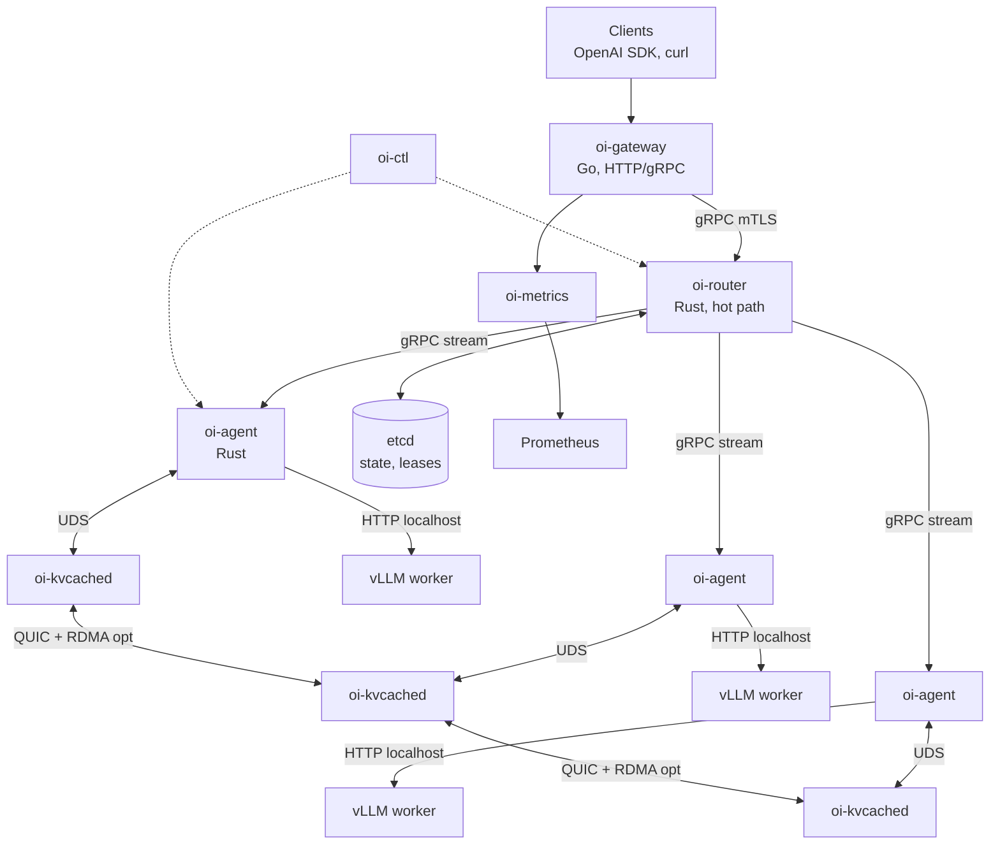
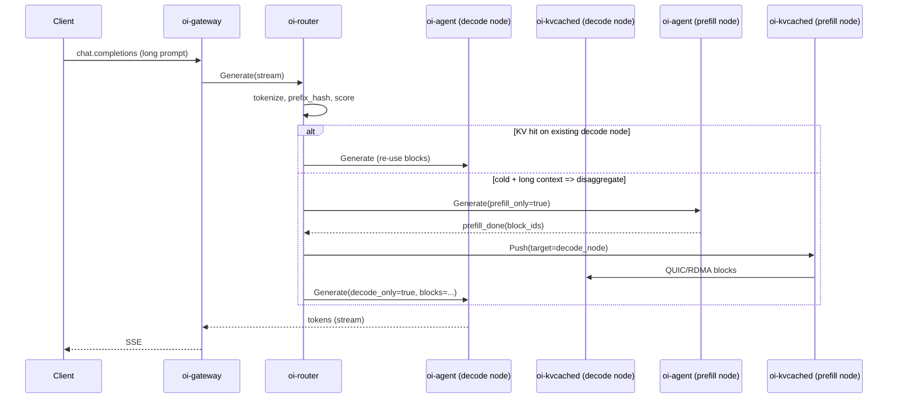

# open-inference -- Production Architecture Plan

A complete, implementation-ready definition of every component, protocol, configuration, and distribution path. No TODOs; every section is concrete.

---

## 1. Project identity

- Name: `open-inference` (binaries prefixed `oi-`)
- License: Apache-2.0
- Repo: monorepo, [open-inference/](.) (Rust + Go workspaces)
- Single source document being implemented: [ai_inference_platform_prod.md](ai_inference_platform_prod.md)
- Inference engine kept as-is: upstream `vllm/vllm` container, unmodified
- What we own (single static executables):
  - `oi-gateway` (Go) -- north/south API
  - `oi-router`  (Rust) -- KV-aware orchestrator
  - `oi-agent`   (Rust) -- per-node sidecar to vLLM
  - `oi-kvcached` (Rust) -- GPU/RAM/SSD KV tier daemon
  - `oi-metrics` (Go) -- Prometheus exporter + power collector
  - `oi-ctl`     (Go) -- admin CLI + installer
  - `oi-operator`(Go) -- Kubernetes operator (controller-runtime)

---

## 2. High-level architecture



Two deployment modes share the same binaries:
- Single-node bare metal: all binaries on one host via systemd
- Distributed: Kubernetes (Helm chart + `oi-operator`) or bare-metal cluster (gossip + etcd)

---

## 3. Repository layout

```
open-inference/
  Cargo.toml                 # Rust workspace
  go.work                    # Go workspace
  proto/                     # protobuf, source of truth for all RPCs
    oi/v1/control.proto
    oi/v1/router.proto
    oi/v1/agent.proto
    oi/v1/kv.proto
    oi/v1/metrics.proto
  rust/
    crates/
      oi-router/             # binary
      oi-agent/              # binary
      oi-kvcached/           # binary
      oi-core/               # shared: tokenizer, prefix-tree, config, telemetry
      oi-proto/              # tonic-generated stubs
      oi-kv/                 # CUDA + RDMA + io_uring bindings
  go/
    cmd/
      oi-gateway/
      oi-metrics/
      oi-ctl/
      oi-operator/
    pkg/
      auth/  ratelimit/  proto/  config/  k8s/
  deploy/
    systemd/                 # *.service units
    helm/oi/                 # Helm chart
    crds/                    # InferenceCluster, ModelPool
    terraform/
      modules/{aws,gcp,azure,hetzner,baremetal}/
      examples/{single-node,multi-node-eks,...}
    installer/
      install.sh             # one-liner bootstrap
      uninstall.sh
  docker/                    # Dockerfiles per binary (distroless)
  docs/
  .github/workflows/         # CI: build, test, sign, SBOM, release
```

---

## 4. Component specifications

### 4.1 `oi-gateway` (Go)
- Purpose: north/south API surface, auth, rate limit, streaming.
- Crates/libs: `net/http` + `golang.org/x/net/http2`, `connectrpc.com/connect`, `github.com/coreos/go-oidc/v3`, `github.com/redis/go-redis/v9` (rate limit backend, optional).
- Endpoints (OpenAI-compatible):
  - `POST /v1/chat/completions`  (SSE streaming)
  - `POST /v1/completions`
  - `POST /v1/embeddings`
  - `GET  /v1/models`
  - `GET  /healthz`, `/readyz`, `/metrics`
- Internals:
  - JWT validator (OIDC discovery URL from config) + static API-key fallback
  - Token-bucket rate limit per principal (in-memory; Redis if `OI_RL_BACKEND=redis`)
  - Translates OpenAI JSON to internal `router.v1.GenerateRequest` proto
  - Pipes back tokens as SSE `data:` frames; ends on `[DONE]`
- Listens: `:8080` HTTP (TLS), `:8443` gRPC (mTLS to clients optional)
- Talks to: `oi-router` via gRPC streaming
- Resource budget: ~50 MB RSS, scales linearly with concurrent streams (goroutine per stream)

### 4.2 `oi-router` (Rust) -- the brain
- Purpose: KV-aware routing, cascade, scheduling, admission control.
- Crates: `tokio`, `tonic`, `axum` (admin), `dashmap`, `arc-swap`, `tokenizers` (HF), `radix_trie`, `parking_lot`, `prometheus`, `tracing`, `etcd-client`, `rustls`.
- Subsystems:
  1. **Cluster view**: watches etcd `/oi/nodes/*`, `/oi/models/*`; gossip fallback via `chitchat` crate when etcd absent.
  2. **Tokenizer pool**: one tokenizer per model family, `Arc<Tokenizer>`; pre-tokenizes prompt for prefix hashing.
  3. **Prefix index**: lock-free radix trie keyed by token-id sequences; each leaf carries `Vec<NodeId>` with TTL and last-seen timestamp. Hash function: BLAKE3 of token-id chunks (every 32 tokens).
  4. **Score function** (executed per request, target <100 µs):

```rust
fn score(node: &Node, req: &Req) -> f32 {
    let kv = kv_overlap_blocks(node, req) as f32 / req.blocks as f32; // 0..1
    let load = 1.0 - node.queue_depth as f32 / node.max_queue as f32; // 0..1
    let pwr = if node.rack_power > node.rack_limit { 0.0 } else { 1.0 };
    let cap = if node.free_kv_blocks >= req.blocks { 1.0 } else { 0.0 };
    0.55*kv + 0.25*load + 0.10*pwr + 0.10*cap
}
```
  5. **Cascade**: per-model-family policy file declares `[slm, mid, llm]`; router first dispatches to SLM with `--logprobs`; if `mean_logprob < threshold` or tool-call requested, escalates. Implemented as a finite-state machine over the streaming response.
  6. **Disaggregation**: separate worker pools tagged `prefill=true` / `decode=true`. For long contexts, router sends `prefill` to a prefill node, then a `kv-handoff` directive instructs `oi-kvcached` to push KV blocks (via QUIC/RDMA) to the chosen decode node, then routes the decode request.
  7. **Admission**: token-budget per tenant; rejects with HTTP 429 (`Retry-After: <seconds>`) when SLO at risk.
- Listens: `:9090` gRPC mTLS, `:9091` admin HTTP (Prometheus + pprof-equivalent).
- Resource budget: ~150 MB RSS at 10k RPS routing.

### 4.3 `oi-agent` (Rust) -- per-node sidecar
- Purpose: uniform protocol over vLLM, model lifecycle, KV-handoff coordination, health.
- Crates: `tokio`, `tonic`, `reqwest`, `nvml-wrapper` (NVIDIA), `sysinfo`, `notify`, `serde`.
- Responsibilities:
  - Spawns/supervises the local `vllm serve …` process (PID 1 in container is the agent; vLLM is a child).
  - Translates internal `agent.v1.Generate` to vLLM OpenAI HTTP on `127.0.0.1:8000`; streams tokens back over gRPC to router.
  - Reports every 250 ms: GPU util, mem, temp (NVML), queue depth (from vLLM `/metrics`), `oi-kvcached` block stats, rack power (Redfish/IPMI optional).
  - Receives `LoadModel`, `UnloadModel`, `KvPush(target_node, prefix_hash)`, `KvPull(...)` directives.
  - Implements graceful drain: sets `ready=false` in etcd, finishes in-flight, exits 0.
- Listens: `:7070` gRPC mTLS (router → agent), UDS `/run/oi/agent.sock` (kvcached, ctl).
- Talks to vLLM: HTTP localhost; vLLM remains the GPU process.
- Resource budget: ~30 MB RSS; CPU negligible.

### 4.4 `oi-kvcached` (Rust) -- KV tier daemon
- Purpose: implement the GPU(hot) → RAM(warm) → SSD(cold) tiering and inter-node KV transfer.
- Crates: `tokio`, `quinn` (QUIC), `io-uring`, `cudarc` (CUDA driver bindings), `rdma-core-rs` (optional, feature `rdma`), `bincode`.
- Storage tiers:
  - **GPU**: vLLM owns the on-GPU paged-attention blocks; `oi-kvcached` does NOT touch them directly. Instead it implements vLLM's KV connector contract (the agent embeds a small Python shim that calls back over UDS to kvcached). On eviction, vLLM hands a block buffer to the connector.
  - **RAM**: pinned host memory pool (`cudaHostAlloc`), default 32 GiB cap, LRU eviction.
  - **SSD**: NVMe directory `/var/lib/oi/kv/`, one file per block, written via `io_uring` O_DIRECT, fsync batched every 50 ms.
  - Index: BLAKE3(prefix_tokens) → block manifest (tier, location, size, last_access). Persisted to RocksDB at `/var/lib/oi/index/`.
- Inter-node transfer:
  - Default: QUIC (quinn) with 0-RTT, CC=BBRv2.
  - Optional: RDMA (RoCEv2/IB) when `feature=rdma` and the NIC is present; kvcached registers MR pools at startup.
- API (UDS, gRPC):
  - `Lookup(prefix_hash) -> {tier, size, owner_node?}`
  - `Promote(prefix_hash)` (cold→warm→hot)
  - `Push(prefix_hash, target_node)` (used by router for prefill/decode handoff)
- Resource budget: configurable; defaults RAM 32 GiB, SSD 1 TiB.

### 4.5 `oi-metrics` (Go)
- Scrapes `oi-router`, `oi-agent`, `oi-kvcached`, `vllm` `/metrics` and exposes a unified Prometheus endpoint with derived metrics:
  - `oi_ttft_seconds` (histogram), `oi_tokens_per_second`, `oi_cache_hit_ratio`, `oi_tokens_per_joule` (= tokens / (rack_watts * dt)), `oi_p95_latency_seconds`.
- Power source: Redfish on a configurable BMC URL or `ipmitool sdr` shell (as a fallback for bare-metal racks).

### 4.6 `oi-ctl` (Go)
- Subcommands:
  - `oi-ctl install --target {single-node|k8s|aws|gcp|azure|hetzner|baremetal} [flags]`
  - `oi-ctl cluster status | nodes | drain <node> | cordon <node>`
  - `oi-ctl model load <name> --replicas N --tp 4 --role prefill|decode`
  - `oi-ctl bench --rps 50 --in 2k --out 256` (smoke + perf)
  - `oi-ctl key create|revoke`
- Embeds Helm SDK and Terraform via shelling out to `tofu`/`terraform`.

### 4.7 `oi-operator` (Go, controller-runtime)
- Watches CRDs (see §8) and reconciles vLLM `Deployment`/`StatefulSet`, `Service`, `ServiceMonitor`, `PodMonitor`, `NetworkPolicy`, `PodDisruptionBudget`, plus our `oi-router`/`oi-gateway` releases.

---

## 5. Wire protocols (gRPC, source of truth)

All defined under [proto/oi/v1/](proto/oi/v1/). Excerpts:

```proto
// router.proto
service Router {
  rpc Generate(stream GenerateRequest) returns (stream Token);
  rpc Embed(EmbedRequest) returns (EmbedResponse);
}
message GenerateRequest {
  string model = 1;
  repeated Message messages = 2;
  SamplingParams params = 3;
  string tenant = 4;          // for quotas
  bytes  prefix_hash = 5;     // optional, gateway may pre-hash
  bool   stream = 6;
}

// agent.proto
service Agent {
  rpc Generate(stream GenerateRequest) returns (stream Token);
  rpc LoadModel(ModelSpec) returns (Status);
  rpc UnloadModel(ModelRef) returns (Status);
  rpc KvHandoff(KvHandoffSpec) returns (Status);   // push/pull blocks
  rpc Health(google.protobuf.Empty) returns (NodeHealth);
}

// kv.proto  (UDS only)
service Kv {
  rpc Lookup(Hash) returns (BlockInfo);
  rpc Promote(Hash) returns (Status);
  rpc Push(PushSpec) returns (Status);
}
```

Transport: `tonic` (Rust) and `connectrpc` (Go) speak compatible gRPC. mTLS mandatory between processes that cross the host boundary; UDS uses SO_PEERCRED.

---

## 6. KV cache tiering -- end-to-end flow



Eviction policy in `oi-kvcached`: cost-aware LRU, weight = `recency * reuse_count / size`. Promotion thresholds configurable in `[kv]` section of `oi.toml`.

---

## 7. Configuration

Single TOML loaded by every binary from `/etc/oi/oi.toml` (override via env `OI_CONFIG`):

```toml
[cluster]
name = "prod-eu"
state_backend = "etcd"   # or "gossip"
etcd_endpoints = ["https://etcd-0:2379","https://etcd-1:2379","https://etcd-2:2379"]

[router]
listen = "0.0.0.0:9090"
admin  = "0.0.0.0:9091"
score_weights = { kv = 0.55, load = 0.25, power = 0.10, capacity = 0.10 }
admission = { max_queue = 1024, ttft_slo_ms = 800 }

[gateway]
listen_http = "0.0.0.0:8080"
oidc_issuer = "https://auth.example.com"
api_keys_file = "/etc/oi/keys"
rate_limit = { rps = 50, burst = 200 }

[agent]
vllm_cmd = ["vllm","serve","{model}","--tensor-parallel-size","{tp}","--enable-chunked-prefill"]
vllm_url = "http://127.0.0.1:8000"
role     = "decode"   # or "prefill"

[kv]
ram_gib = 32
ssd_dir = "/var/lib/oi/kv"
ssd_gib = 1024
transport = "quic"    # or "rdma"

[security]
ca_file   = "/etc/oi/pki/ca.pem"
cert_file = "/etc/oi/pki/node.pem"
key_file  = "/etc/oi/pki/node.key"

[models.llama3-70b]
cascade = ["llama3-8b","llama3-70b"]   # SLM -> LLM
prefill_replicas = 2
decode_replicas  = 6
tp = 4
```

---

## 8. Kubernetes design

### CRDs (in [deploy/crds/](deploy/crds/))
- `InferenceCluster`: top-level spec (etcd ref, security, gateway HPA).
- `ModelPool`: model name, role (prefill/decode), replicas, TP, GPU class, cascade.
- `RoutingPolicy`: score weights, tenant quotas.

### Reconciliation produced by `oi-operator`
- `Deployment` per ModelPool (vLLM container + `oi-agent` sidecar + `oi-kvcached` sidecar in same Pod, sharing `emptyDir` for UDS).
- `Service` headless for agents; router resolves via DNS SRV.
- `Deployment` for `oi-router` (3 replicas, leader election via etcd lease).
- `Deployment` for `oi-gateway` with HPA on QPS.
- `ServiceMonitor` + `PodMonitor` (kube-prometheus-stack compatible).
- `PodDisruptionBudget` `minAvailable: 50%` per ModelPool.
- `NetworkPolicy`: deny-all default + explicit allows (gateway→router, router→agents, agent↔kvcached, kvcached↔kvcached).

### Helm chart (`deploy/helm/oi/`)
- Subcharts: `etcd` (Bitnami, optional), `kube-prometheus-stack` (optional).
- Values for: image tags, GPU node selectors, tolerations, security TLS bundle, model catalog (templated into `ModelPool` CRs).

---

## 9. Bare-metal / single-node deployment

systemd units shipped in [deploy/systemd/](deploy/systemd/):
- `oi-router.service`, `oi-gateway.service`, `oi-agent@.service` (templated per-GPU), `oi-kvcached.service`, `oi-metrics.service`.
- Each unit: `Type=notify`, `Restart=on-failure`, `User=oi`, `AmbientCapabilities=CAP_SYS_NICE`, `MemoryMax=` set per role.
- vLLM runs as `oi-vllm@<modelname>.service` (also systemd unit; agent supervises restart but systemd is the cgroup parent for resource accounting).
- Single-node demo: `oi-ctl install --target single-node --model llama3-8b` provisions one of each binary with embedded etcd (single-node) and self-signed mTLS PKI.

---

## 10. IaaS distribution -- one installer, four clouds + bare metal

Top-level command:
```bash
curl -fsSL https://get.open-inference.dev | sh -s -- --target aws --region eu-central-1 --gpus 8xa100
```

What `install.sh` does:
1. Detect arch/os, fetch matching `oi-ctl` binary from GitHub Releases (cosign-verified).
2. Run `oi-ctl install --target <t> [flags]` which embeds Terraform modules.

Terraform/OpenTofu modules under [deploy/terraform/modules/](deploy/terraform/modules/):

- **`aws/`**: VPC, EKS (with `karpenter` for GPU autoscaling), `g5`/`p5` node group, EFS for model cache, IAM IRSA, ALB ingress, KMS, secrets in SSM, Route53. Outputs kubeconfig.
- **`gcp/`**: GKE Autopilot or Standard, A2/A3 node pools, Filestore, Workload Identity, Secret Manager, GCLB.
- **`azure/`**: AKS, NC/ND-series, Azure Files Premium, Workload Identity, Key Vault, App Gateway.
- **`hetzner/`**: dedicated GPU servers via Hetzner Cloud + Robot API; cloud-init bootstraps k3s + cilium + longhorn; bring-your-own DNS.
- **`baremetal/`**: Ignition/cloud-init templates for Ubuntu 24.04 + NVIDIA driver + Docker; Ansible playbook to install systemd units; optional MetalLB + k3s.

Each module exits with the same artifact: a kubeconfig (or a `cluster.json` for systemd mode). `oi-ctl` then runs `helm install oi deploy/helm/oi -f values.yaml` against it.

Distribution channels:
- GitHub Releases (signed tarballs, SBOM, checksum)
- Container images: `ghcr.io/open-inference/oi-{router,gateway,agent,kvcached,metrics,operator,ctl}:vX.Y.Z` (distroless, multi-arch amd64+arm64)
- Helm repo: `oci://ghcr.io/open-inference/charts/oi`
- Homebrew tap and `apt`/`dnf` repos for `oi-ctl`
- One-liner installer hosted at `get.open-inference.dev` (static script in repo, served via Cloudflare Pages)

---

## 11. Security model (standard tier)

- **Transport**: mTLS for every cross-process gRPC; TLS 1.3 only; certs from internal CA.
- **PKI**: `oi-ctl pki init` generates a CA + per-role certs; `cert-manager` integration in k8s (`Issuer` + `Certificate` CRs); rotation every 90 days, automated.
- **AuthN**: gateway accepts (a) OIDC JWT (validated against issuer JWKs) or (b) static API keys (BLAKE3-hashed, stored in `keys` file, rotatable via `oi-ctl key`).
- **AuthZ**: per-tenant scopes baked into JWT (`oi:model:<name>:invoke`, `oi:admin`); RBAC table loaded from `oi.toml`.
- **Secrets**: never in env vars at rest; in k8s, mounted via `Secret` -> `projected` volume; on bare metal, `/etc/oi/secrets/` with `chmod 600` + `chown oi`.
- **Rate limiting + abuse**: per-tenant token-bucket; circuit breaker on per-tenant 5xx rate.
- **Sandboxing**: containers run as non-root UID 10001; `readOnlyRootFilesystem: true`; `seccompProfile: RuntimeDefault`; `capabilities.drop: ["ALL"]` (vLLM container needs `SYS_NICE` only).
- **Network**: default-deny `NetworkPolicy`; egress allowlist to model registry (S3) and OIDC issuer.
- **Supply chain**:
  - Reproducible Rust builds (`--locked`, `cargo-vet`, `cargo-deny`).
  - Go builds with `-trimpath -buildvcs=true`.
  - SBOM with `syft` per artifact, attached to release.
  - Container & binary signing with `cosign` (keyless via GitHub OIDC).
  - SLSA level 3 provenance via GitHub Actions reusable workflow `slsa-framework/slsa-github-generator`.
  - `cosign verify` invoked by `install.sh` before any binary executes.
- **Audit**: structured JSON logs (request id, tenant, model, prompt-hash, latency); shipped to OpenTelemetry collector; never log prompts unless `audit.full_payload=true` (compliance opt-in).
- **Vulnerability mgmt**: `trivy` scan in CI; weekly `dependabot` + `cargo update` PRs.

---

## 12. Observability

- Metrics: Prometheus scraping `oi-metrics`. Grafana dashboards shipped in [deploy/helm/oi/dashboards/](deploy/helm/oi/dashboards/) (TTFT, tokens/s, cache hit, tokens/joule, queue depth, GPU util/temp, rack power).
- Tracing: OpenTelemetry traces (`tracing-opentelemetry` Rust, `otelhttp` Go); spans: `gateway.handle` → `router.route` → `agent.generate` → `vllm.http` → `kvcached.lookup`.
- Logs: JSON to stdout; collected by Loki (k8s) or `journald` (bare metal).
- Alerting rules (PrometheusRule CR): TTFT p95 > 1s for 5m, cache hit < 0.3 for 10m, GPU temp > 85 °C, rack power > 90% for 2m, error rate > 1%.

---

## 13. Build & release pipeline

GitHub Actions in [.github/workflows/](.github/workflows/):
- `ci.yml`: matrix (linux/amd64, linux/arm64) -- `cargo test`, `cargo clippy -- -D warnings`, `go test ./...`, `golangci-lint`, `buf lint`, `buf breaking`.
- `release.yml`: triggered on tag `v*`:
  1. Build all 7 binaries (Rust with `cross`, Go with native).
  2. `syft` SBOM, `cosign sign-blob`, attach to GitHub Release.
  3. `docker buildx bake` distroless multi-arch images; `cosign sign`.
  4. Helm chart packaged + pushed to OCI; index updated.
  5. Terraform module versioned tag.
  6. Homebrew formula bumped via PR.
  7. SLSA provenance attestation.
- `e2e.yml` (nightly): kind cluster + GPU runner; runs `oi-ctl bench` and asserts SLOs.

---

## 14. Performance targets (used as CI gates)

- `oi-router` routing decision: p99 < 500 µs at 10k RPS on 1 vCPU.
- `oi-gateway` overhead vs direct vLLM: < 1 ms p50, < 3 ms p99.
- `oi-kvcached` warm tier hit: < 200 µs; cold (SSD) hit: < 5 ms; cross-node QUIC fetch (10 GbE): < 12 ms for 1 MiB block.
- Cache hit ratio target on representative trace: ≥ 0.55.
- Tokens/joule: ≥ 1.4× round-robin baseline.

---

## 15. Phased rollout (definition only, not execution)

- M1 -- Skeleton: protos, `oi-router` + `oi-agent` + `oi-gateway` minimal path, single-node systemd installer.
- M2 -- KV: `oi-kvcached` GPU/RAM/SSD tiers, prefix index, sticky routing, Prometheus.
- M3 -- Disagg + cascade: prefill/decode separation, KV handoff (QUIC), SLM→LLM cascade.
- M4 -- K8s: CRDs, `oi-operator`, Helm chart, `cert-manager`, `kube-prometheus-stack` integration.
- M5 -- IaaS: Terraform modules for AWS/GCP/Azure/Hetzner/baremetal, one-liner installer, signed releases.
- M6 -- Hardening: SLSA provenance, full SBOM, fuzzing (cargo-fuzz on router parsers), chaos tests.

---

## 16. Out of scope (explicit)

- Training / fine-tuning.
- Model weights distribution (use HF Hub or S3; we only cache).
- Multi-tenant GPU partitioning beyond MIG passthrough.
- FIPS / confidential computing (deferred to "regulated" tier).
